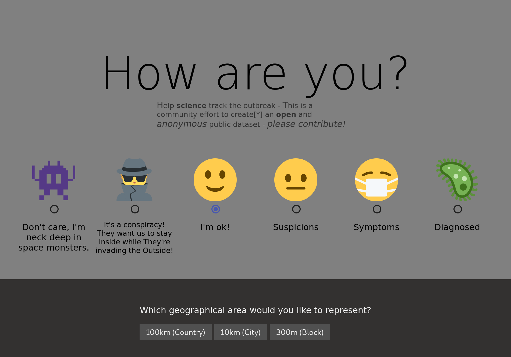

# survive.click

> **An artificial pandemic of happniess**

In order to create a system that can track a pandemic
on a global scale and in _real time_.

I suggest that we combine all the public platforms into on single
massive database capable of processing a global living dataset.

```
Combine all the computers in the world into one big computer?!
But that's impossible!
```

I can't tell you if it's sane or not but I can _show_ you that it is
entierly possible:

Using modern computer science - cryptographically [Secure Ledgers](https://pfrazee.hashbase.io/blog/secure-ledgers-dont-require-proof-of-work) to be specific.

I have created a viral mini game that treats any and all platforms as it's own personal database - demonstrating completely decentralized metrics storage without user registrations.

The software has no server of it's own and lives
entierly on freely available resources.

Yes, it is a "cloud virus" - but it's a friendly happy virus that we, humans, are immune to.

## <a name="Play"></a>  How to play
 

#### Rule #1
```
Once a day or once a week hide an mood pebble
somewhere in public to let us know you're still playing.
```
For now, that's it!


We're currently working on the expansion that will include
flashy graphs and diagrams and also support live maps!

## Wait a moment..
```
How does this help create a system able to contain a pandemic?
```

In order for our data analysts and journalists to create content [like this](https://www.svt.se/datajournalistik/har-sprider-sig-coronaviruset/)

They need to be given free access to clean fresh data.

If we think of the combined super computer mentioned above
as an ant colony, it is easier to imagine the self-organising hyper system that I am about to propose.

This game is but one type of ant that inhabits the imagined hive.
It has a single purpose to generate cryptograpihcally unique data (pebbles) in order to survive.
The game itself is so small that it requires virtually
zero resources and can sustain itself on the scraps left by our digital society.

**Next step** is to design the 'collector'-ant whose sole purpose will be
to collect pebbles, decrypt them and attach labels on _where_ and _when_ it was collected.

In other words enriching the data with real business value.

**Final problem**

Ok, so now we have generated the data and we've cleaned it
but how do we do we deliver it to our analysts?

As it turns out, we're lucky!

This problem has already been solved by another community of brilliant hackers.
They've created a type secure feed that excels at distribution.

The [hypercore](https://github.com/mafintosh/hypercore) is really efficient
at copying data from one computer to many.

I plan to design the collector-ant to record the enriched statements in such feeds.

```
This will give our analysts unrestricted and immediate access to a stream of clean fresh data.
```

And what I believe is the absolutely best part;
Is that the architecture is designed in such a way that anyone is free
to create their own breed of ants or design their own hyper system.

All you have to do is grab a name, and ask a different question




If people find your software useful, then it will [survive](https://survive.click/#PIC0FDSPKEYvIRALxRS67jIQ2tMC1noeN%2FoJrG0kxVvKmKJVM9Tn1MBLOCKX5S7wlL2%2BTCaZLOTNHUpVQA6jRa208zIgi7r7CaxGW6QntfHnoLvoVqHp%2FSc%2FyvM4Rz7oyhP7ZTGoA6x5u9YCAAAAAAAAAAAAAAAAAAAAAAAAAAAAAAAAAAAAAAAAAAAAAAAAAAAAAAAAAAAAAAAAAAAAAAAAAAAAAAAAAAAAAAAAABMCkoIuteAtpQuEiC%2FSIPbiC2D%2Bh%2BjEsBa2zX66kSpea0J75licq4SewWmKjIfSGVsbG8gV29ybGQhIEhvdyBhcmUgeW91IGRvaW5nPwSPKEYgZ9ldziyRmgi0xgrx66NAWMlPeRl%2BVVzzfdz%2BpqxpUwBLOCKLc8ul35z9yL2LMtkiSTUqVoZbMQB7LGawncUVabz89KHO9AA0Nk1%2FMSWUmmd%2FmELU7hoQY6CLq8Rsr%2BnMC1HCF%2BUu8JS9vkwmmSzkzR1KVUAOo0WttPMyIIu6%2BwmsRlukJ7Xx56C76Fah6f0nP8rzOEc%2B6MoT%2B2UxqAOsebvWAgAAACjEqABClBzd%2BqGwYC4wmhwNSuxHq5LAEaJ4u3a9UXKzFipi0GaDiKOM98jM%2B7s%2BcefecoHktFVqIQPWjvLaaX8bIJak6G%2FO8Yyyqcm0TN%2BXI2CLOt7MxIqdOgpXjXKhc6Ji8v3zf%2FH51jG9vrz5U24n1iK0Lx1tLSkzzqn28ukxuOxGiD0k1lQQ7UKUetTed2x1SDOxIOn974%2BUjU%2B7I%2Bk2oN%2Bcg).

## Architecture Design notes

The game is a tiny cyber organism that does everything it can
to surivive.

Every time the user shares it's link the game has a chance to recruit
new players.

To make this a little bit more fun than chain-letters
every time the game is replicated, it's state mutates...

Letting each player add their own individual value to the shared link,
in turn making _all shared links uniquely valuable_.

The game was designed with the following paramters:

- No installation
- No registrations
- No database
- No API's/backends
- No tracking / analytics
- No direct network connections
- Maximal replication
- Minimal resource requirements
- Should run anywhere (even in places without internet)

If you're thinking blockchain, then yes you're not too far off,
it uses the same basic building block that blockchains and accounting systems use
a secure feed/ledger.

I have designed and implemented a microscopic cryptographically _secure feed_
that fits inside of an **URL**

Say hello to [PicoFeed](https://github.com/telamon/picofeed) (Cyber Virus RNA 🤯)

A tiny chain of blocks that infects social
platforms and uses their databases to store and propagate the game's
own data.

What makes me really excited is that it can be used on any platform or communication
channel that supports the act of sharing a simple URL.

Don't worry it's mostly harmless to the platform, as the picochains weight
below 1kilobyte.

That's about 0.5% or 200 times smaller than your avreage selfie. :)

The entire program is contained in 1 single file which
makes the game very easy to share on a limited or even without a network.

You can download the webpage to an usb-memory and the game will still
operate as intended without a server.

The game it self is only 180kilobytes in size, this is mostly because i'm
short on time ;) compressed it's 56k.

There is alot of more research embedded in this micro-project,
the decentralized electronic voting system (**caugh** Experimental Toy voting system) is contained in the [Cryptology](https://github.com/telamon/cryptology) repository

Enjoy!

P.S.
I almost forgot, here are the keys you need to collect votes,
To create an open incentive for the collection
and anonymization of the data is my next step in this project.
```
v0iD24gtg/ofoxLAWts1+upEqXmtCe+ZYnKuEnsFpio
eiXBv+DUz6HEN06RpUXZntYezvy6cc+/6ceJH8mM7k8
```

```ad
 _____                      _   _           _
|  __ \   Help Wanted!     | | | |         | |
| |  | | ___  ___ ___ _ __ | |_| |     __ _| |__  ___   ___  ___
| |  | |/ _ \/ __/ _ \ '_ \| __| |    / _` | '_ \/ __| / __|/ _ \
| |__| |  __/ (_|  __/ | | | |_| |___| (_| | |_) \__ \_\__ \  __/
|_____/ \___|\___\___|_| |_|\__|______\__,_|_.__/|___(_)___/\___|

If you're reading this it means that the docs are missing or in a bad state.

My research is producing public code at a higher rate than documentation,
thus you have my sincere apologies.

If you have any questions, PLEASE OPEN AN ISSUE -
I'll do my best to gingerly provide an answer.

I publish all of my work as Libre software and will continue to do so,
please drop me a penny at Patreon and help fund experiments like these.

Patreon: https://www.patreon.com/decentlabs
Github: https://github.com/telamon/survive.click
Discord: https://discord.gg/K5XjmZx
Telegram: https://t.me/decentlabs_se
```

## <a name="Develop"></a> Develop

```bash
yarn start
```

## <a name="Deploy"></a> Deploy

```bash
yarn build
git commit -am "changes"
git push
```

## <a name="contribute"></a> Contributing

Ideas and contributions to the project are welcome but must follow the [guidelines](https://github.com/telamon/survive.click/blob/master/CONTRIBUTING.md).

## License

GNU AGPLv3 © Tony Ivanov
