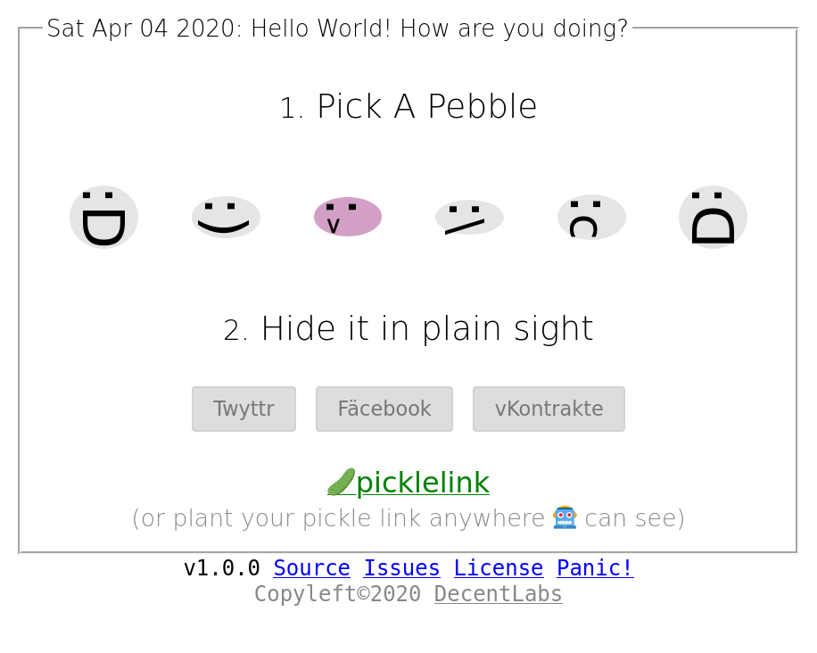

[](https://standardjs.com)

# survive.click

> An artificial pandemic of happniess



## Release Notes 1.0

Hello World

I see you're still trying to track the pandemic in real time.
Silly world, pandemics are way too decentralized to be tracked
using conventional means. It's too fast for you!

If we want to use our technology to keep up with viruses then
the way we generate and process data needs to be adjusted.

To illustrate the problem,
I have designed a small game with viral properties -
a social experiment.

The game let's the player care for their indivdual mental
health and simultaneously contribute to an free and open
dataset.

I hope to give the engineering community
a second chance to process live exponential
data without a central node.

### One simple rule

> Once a day (maybe in the evening after brushing your teeth )
> hide an encrypted mood pebble somewhere in public.
>
> Don't despair if you miss a few days, just chime in once a week
> to let us know you're still there :sweat_smile:

Yeah, this game is designed for us who are stuck at home and are starting feel the effects of cabin fever. :ghost:


I believe that if we can cooperate to design decentralized system able to continually collect all the pebbles generated by all the players.

Then we would be able to aggregate the data and put an **avreage current mood** marker on the map of my neighbourhood or what used to be my workplace.

If we can do that! Then I am confident that we can reapply the technology, to stick an **risk of infection** marker on my local grocery store.

Which I believe is economically more
beneficial than a prolonged nation wide curfew.


Don't believe me? Just imagine that the leftmost pebble indicates `no infection` and
the rightmost signifes a `diagnosed case`. I've already hidden a few pebbles out there,
try and find them if you can [:>](https://survive.click/#%F0%9F%A5%92%F0%9F%97%9DvIRALxRS67jIQ2tMC1noeN%2FoJrG0kxVvKmKJVM9Tn1M%F0%9F%90%88WrGcbgOFA7Mw220iADfT6qkL8aWo8kfUZjGBLCZ819bqcJmO%2BTwzSWJMgqdLJqfEPxfJ%2BOgmSrDwO%2Ft3v1W2BAAAAAAAAAAAAAAAAAAAAAAAAAAAAAAAAAAAAAAAAAAAAAAAAAAAAAAAAAAAAAAAAAAAAAAAAAAAAAAAAAAAAAAAAABMCkoI2J%2BskZQuEiC%2FSIPbiC2D%2Bh%2BjEsBa2zX66kSpea0J75licq4SewWmKjIfSGVsbG8gV29ybGQhIEhvdyBhcmUgeW91IGRvaW5nPw%F0%9F%97%9DLoFdpyN6w89lfGU0iOdSmAtE7191nTy1f5hYHbn3uW0%F0%9F%90%88TuFHJ7%2Bsy%2F0nqgKelQf2taVUV0dzF%2BFADT8VJ4%2B%2BpL%2F7%2B74mZsSfkgbOvxbW%2FR2BH2ku2RLaMyi5%2BcXWdqWTAVqxnG4DhQOzMNttIgA30%2BqpC%2FGlqPJH1GYxgSwmfNfW6nCZjvk8M0liTIKnSyanxD8XyfjoJkqw8Dv7d79VtgQAAACjEqABClC0bCaPiRlFLUIIK7uYVJflDXUebXpyqmgRUyAe8dghQZB%2B5G0VdoJ3f1UnNem2RAuGW7%2FRPGp4LbVwAB8ocnXSfEmksL9HEY9ZzdhDytO0gxIqYEffrYJcNLTSiFIP9xj9RRm9IrZ7ollgOmLU21LW%2FJiEmLRliP7VNbXFGiBZGlR11SUZHCb3lsjklhcmDd4GG9UJ1uev%2BrMCfSgoZw)


Screenshot of the first prototype, I ended up with some scope
cuts due to funding constraints.

## Architecture Design notes

This game is a tiny cyber organism that does everything it can
to surivive.

Every time the user shares it's link the game has a chance to recruit
new players.

To make this a little bit more fun than chain-letters
every time the game is replicated, it's state mutates...

Letting each player add their own individual value to the shared link,
in turn making _all shared links uniquely valuable_.

The game was designed with the following paramters:

- No installation
- No registrations
- No database
- No API's/backends
- No tracking / analytics
- No direct network connections
- Maximal replication
- Minimal resource requirements
- Should run anywhere (even in places without internet)

If you're thinking blockchain, then yes you're not too far off,
it uses the same basic building block that blockchains and cashregisters use
a **Secure Feed**

I have designed and implemented a microscopic cryptographically _secure feed_
that fits inside of an **URL**

Say hello to [PicoFeed](https://github.com/telamon/picofeed) (Cyber Virus RNA 🤯)

A tiny chain of blocks that infects social
platforms and uses their databases to store and propagate the game's
own data.

What makes me really excited is that it can be used on any platform or communication
channel that supports sharing a simple link.

Don't worry it's mostly harmless to the platform, as the picochains weight
below 1kilobyte.
That's about 0.5% or 200 times smaller than your avreage selfie. :)

The entire program is contained in 1 single file which
makes the game very easy to share even without a network.

You can download the webpage to an usb-memory and the game will still
operate as intended without a server.

The game it self is only 180kilobytes in size, this is mostly because i'm
short on time ;) compressed it's 56k.

There is alot of more research embedded in this micro-project,
the decentralized anonymous voting system (**caugh** Experimental Toy voting system) is contained in the [Cryptology](https://github.com/telamon/cryptology) repository

Enjoy!

Here are the keys you need to collect votes,
which is going to be my next project.
```
v0iD24gtg/ofoxLAWts1+upEqXmtCe+ZYnKuEnsFpio
eiXBv+DUz6HEN06RpUXZntYezvy6cc+/6ceJH8mM7k8
```

```ad
 _____                      _   _           _
|  __ \   Help Wanted!     | | | |         | |
| |  | | ___  ___ ___ _ __ | |_| |     __ _| |__  ___   ___  ___
| |  | |/ _ \/ __/ _ \ '_ \| __| |    / _` | '_ \/ __| / __|/ _ \
| |__| |  __/ (_|  __/ | | | |_| |___| (_| | |_) \__ \_\__ \  __/
|_____/ \___|\___\___|_| |_|\__|______\__,_|_.__/|___(_)___/\___|

If you're reading this it means that the docs are missing or in a bad state.

My research is generating code at a higher rate than documentation and
I'm personally drowning in small administrational todos.
Thus you have my sincere apologies.

If you have any questions, PLEASE OPEN AN ISSUE -
I'll do my best to gingerly provide an answer.

I publish all of my work as Libre software and will continue to do so,
please drop me a penny at Patreon: https://www.patreon.com/decentlabs
and help fund experiments like theese.
```

## <a name="Develop"></a> Develop

```bash
yarn start
```

## <a name="Deploy"></a> Deploy

```bash
yarn build
git commit -am "changes"
git push
```

## <a name="contribute"></a> Contributing

Ideas and contributions to the project are welcome. But you must follow the [guidelines](https://github.com/telamon/survive.click/blob/master/CONTRIBUTING.md).

## License

GNU AGPLv3 © Tony Ivanov
